# Connect 4 | An advanced version

**Author**
```
Name: Fatema Moharam
ID  : 6655
```

AI agent plays against the player until the board is full. The score of each player is the total number of *fours-in-a-row*. The game dimensions are as follows (rows = 6, columns = 7).

[Link to the project public repo on *Github*.](https://github.com/moharamfatema/connect-4-python)

## Project structure:

```
|_ src
    |_main.py
    |_model
    |   |_grid.py
    |   |_state
    |   |   |_state.py
    |   |   |_integer_state.py
    |   |   |_string_state.py
    |   |_agent.py
    |_view
    |   |_game.py
    |   |_main_frame.py
    |_img
```

## Requirements and Running the code

This code was tested on windows inside a python3.9 virtual environment (venv). To visualize the tree, `pydot` needs to be installed on the system and added to PATH in the environment variables. see [documentation](https://pypi.org/project/pydot/).

To run the code, navigate to the root folder (that contains `src` and `out`) and run:

```bash
.\env\Scripts\activate # only if you're using venv
pip install -r requirements.txt
py .\src\main.py
```

## GUI

The game starts in two separate windows, one containing the game board, the other is the control panel.

The control panel
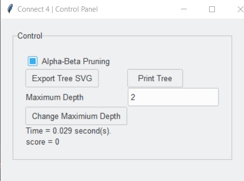  
The Board
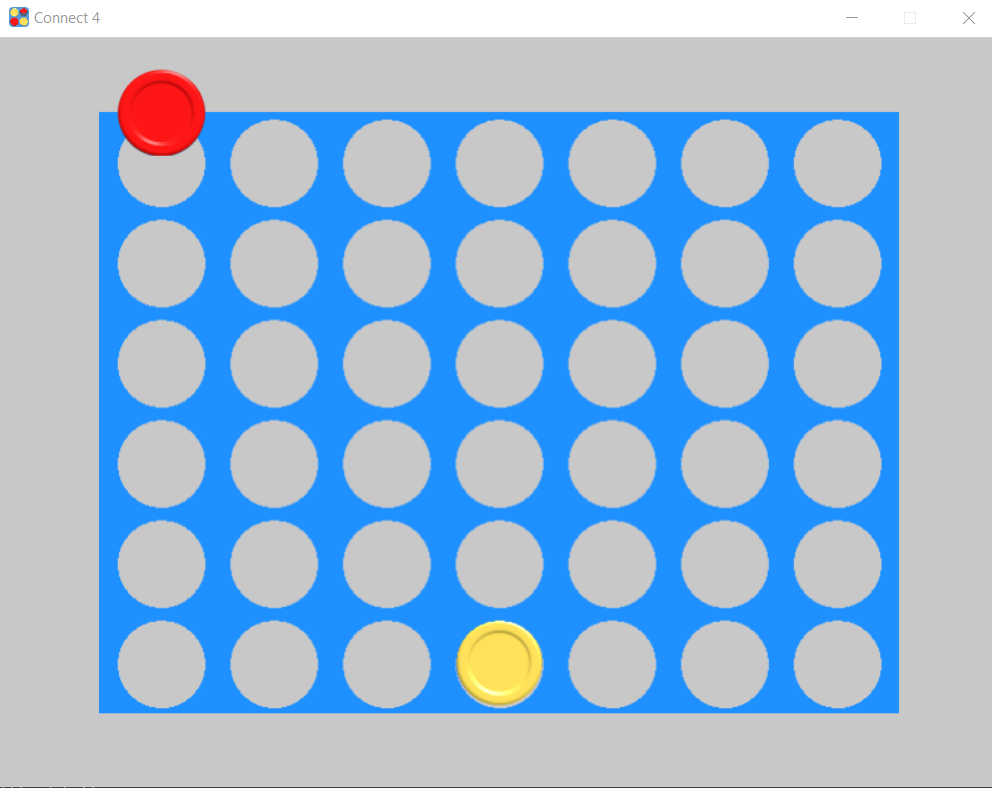

The `Print Tree` button prints the tree in the console. 
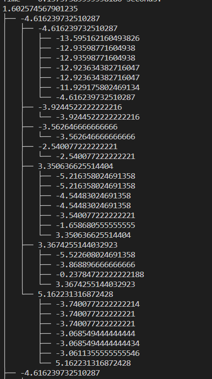

The `Export Tree SVG` outputs the tree drawn in an SVG file in the `out` folder
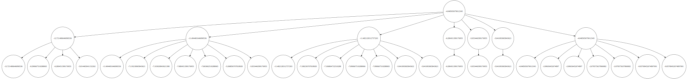

## Starting turn  

The app randomly picks a starter. If the agent is the starter, a coin is placed in the middle of the board.

## Performance

Below are the time intervals the minimax algorithm is expected  to take (roughly, usually takes a couple seconds more or less) for depths from 1 through 13:
> 0.002 seconds.  
> 0.012 seconds.  
> 0.081 seconds.  
> 0.569 seconds.  
> 3.982 seconds.  
> 27.875 seconds.  
> 195.126 seconds.  
> 1365.884 seconds.  
> 9561.187 seconds.  
> 66928.31 seconds.  
> 468498.172 seconds.  
> 3279487.203 seconds.  
> 22956410.419 seconds.  

Alpha beta algorithm performs significantly better based on the rate of pruning

## Sample Runs

Note: The following sample runs will only use depth of 2, otherwise the tree will be too large to appear correctly in the report.

### Minimax

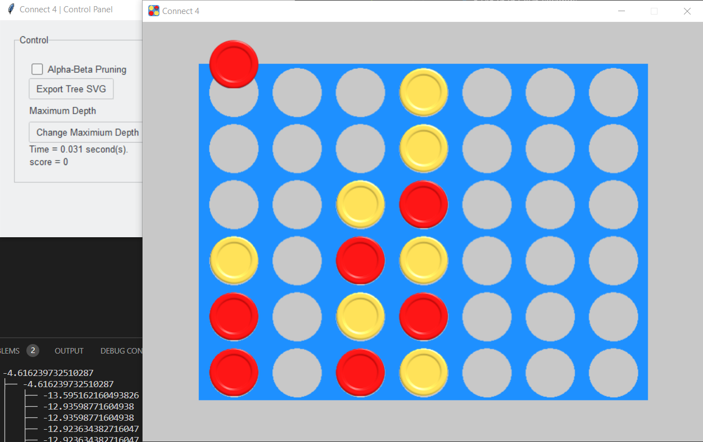

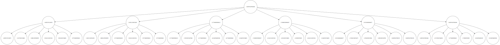

### Alpha - Beta Pruning

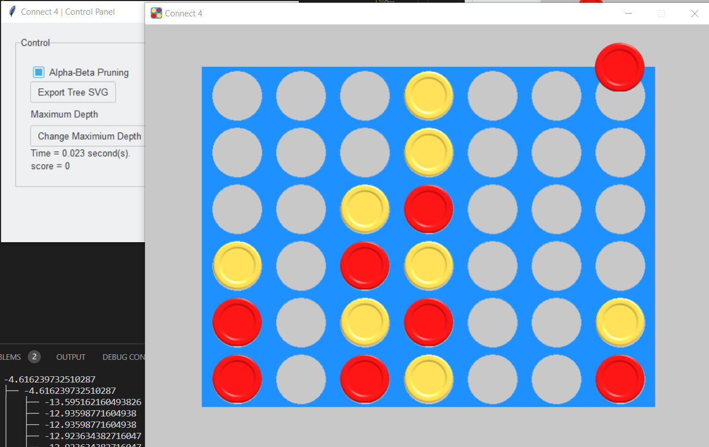

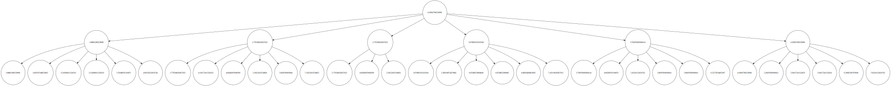

## Increasing depth

Alpha-beta can easily go up to 11 levels in the range of 23 seconds, while mminimax algorithm reaches only level 9, in abput 40 seconds. Minimax algorithm at level 11 exceeds 50 seconds. causing timeout.

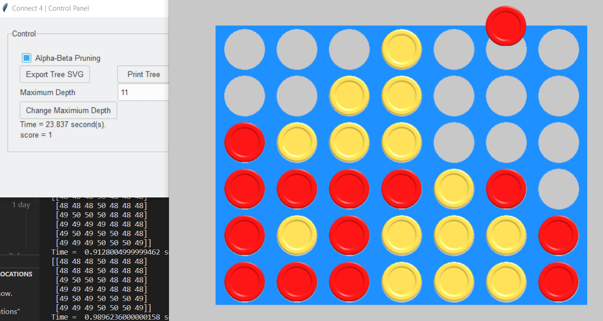
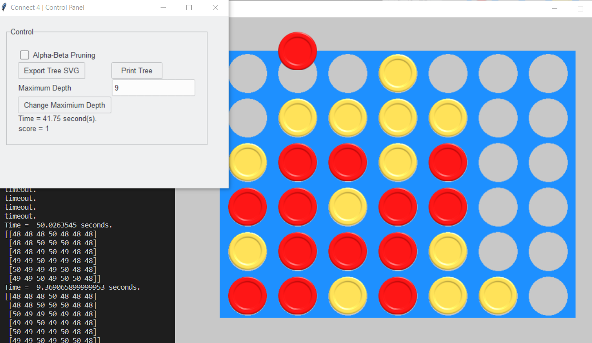

Minimax Timeout at level 11
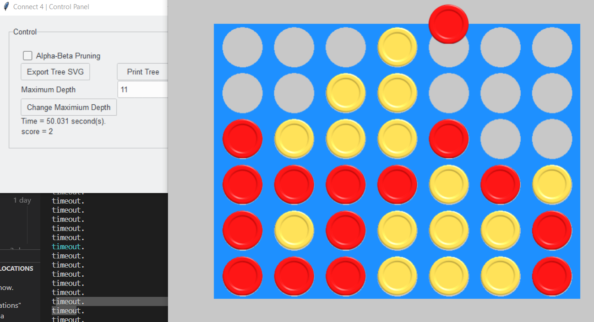

## Heuristic function

- The final shape of the function:   
h = (1 - Cp(fail)) * x + Cp(fail) * (x - 1)  
c : number of empty spaces.  
x : expected score in the ideal case.  
p(fail) : the probability of one of the empty spaces being filled by an opponent's coin.  

**For the sake of playing in defense mode:**  
 
When calculating the expected score, the expected `HUMAN` score should be given a greater weight that the `AGENT` score, by multiplying the value by around 1.5 (50% more weight).

## Used data structures

- Explored hashmap : Python dictionary.
    stores( key: value) pairs.  
    Unique keys for each explored state being what the board looks like and whose turn it is represented as a ``string``.  
    Values: The minimax function return value.  
    The explored dict is cleared at the beginning of each turn.

- Tree : from the `treelib` package. Each node in the tree is a `Node` class storing the heuristic/score value of the minimax node, and a unique tree ID that stores the unique key used in the explored dict, in addition to an indicator to whether the node is a duplicate (similar to one of it's cousins). see [documentation](https://treelib.readthedocs.io/en/latest/).

- grid : The score and heuristic calculations, and the `Game` class use a representation of the board as a **2D `numpy` array of Bytes**. The single byte stores an `ascii` value of what the state sees as a string.

## Outline of the modules

According to the **MVC** design pattern:
- Model contains the core algorithms of the AI agent.
- View contains the `pygame` GUI and the `Tkinter` GuI.
- Main.

### Model:
- ### Grid

- Attributes:  
    - `__grid`: 2D `numpy` array of bytes, representing the board.

- Most important methods:
    - Score calculation.
    - Heuristic calculation.
    - Grid to string conversion.
    - Children generation.
    - Terminal board check.

- ### State

State is a package that contains:
- An *abstract* `State`class.
- A `StringState` class that inherits from `State`. (used)
- An `IntegerState` class that inherits from `State`. (unused)

- State attributes:
    - Turn (either `HUMAN` or `AGENT`).
    - Representation (`string`).
    - Grid.
    - Tree ID.

- ### Agent

- Attributes
    - Explored
    - Tree
    - Maximum Depth
    - Time

- Most important methods:

    - Solve  
    pseudocode:  
    ```python
    solve( state:State , alph_beta_pruning:Bool) -> State:
        clear explored
        clear tree

        depth = 0
        if alpha_beta_pruning:
            a = -inf
            b = inf
            (result, val) = max(state,depth, a, b)
        else
            (result, val) = max(state, depth)

        return result
    ```
    - Max  
    pseudocode:  
    ```python
    max(self, state : State, depth : int,alpha , beta) -> tuple [State, int]:
        if explored return explored[state]
        if terminal or depth >= max depth return (None,score)
        
        max_child = None
        max_util = -inf
        children = state.get_children()

        for child in children:

            nxt = min(child,depth + 1,alpha,beta)

            utility = nxt[1]

            if utility > max_util:
                max_child = child
                max_util = utility

            if alpha is not None and beta is not None:
                if max_util >= beta:
                    break

                if max_util > alpha:
                    alpha = max_util

        add state to explored and tree
        
        return (max_child, max_util)
    ```

    - Min  
    pseudocode:  
    ```python
    min(self, state : State, depth : int,alpha , beta) -> tuple [State, int]:
        if explored return explored[state]
        if terminal or depth >= max depth return (None,score)
        
        min_child = None
        min_util = inf
        children = state.get_children()

        for child in children:

            nxt = max(child,depth + 1,alpha,beta)

            utility = nxt[1]

            if utility > max_util:
                max_child = child
                max_util = utility

            if alpha is not None and beta is not None:
                if max_util >= beta:
                    break

                if max_util > alpha:
                    alpha = max_util

        add state to explored and tree
        
        return (min_child, min_util)
    ```

